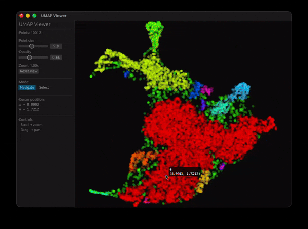

# UMAP Viewer

An interactive GPU-accelerated viewer for [UMAP](https://umap-learn.readthedocs.io/) 2D embeddings. Supports hundreds of thousands of points with smooth pan/zoom, polygon selection, category filtering, and a sortable data table. Runs as a native desktop app or in the browser via WebAssembly.



---

## Features

- **GPU rendering** — instanced quad rendering via wgpu; antialiased circles; handles 500k+ points at interactive frame rates
- **Pan / zoom** — drag to pan, scroll wheel to zoom (0.05× – 500×)
- **Polygon selection** — click to place vertices, close near the start to select; right-click to cancel
- **Category histogram** — right panel shows the distribution of selected points across categories
- **Sortable table** — bottom panel lists selected points with sortable columns: `#`, `Category`, `Label`, `X`, `Y`
- **Hover tooltip** — cursor data coordinates + nearest-point label shown in the side panel
- **Dual target** — identical code base builds for macOS / Linux / Windows (native) and the browser (WASM / WebGL2)

---

## Architecture

```
umap_viewer/
├── src/
│   ├── main.rs            # Entry points: native CLI + WASM init
│   ├── lib.rs             # Module re-exports
│   ├── config.rs          # config.yaml loader (native only)
│   ├── data.rs            # PointCloud, SpatialGrid, parquet & binary I/O
│   ├── app.rs             # egui application: UI panels, interaction, rendering
│   ├── point_renderer.rs  # wgpu pipeline, vertex buffers, uniforms
│   └── shaders/
│       └── points.wgsl    # WGSL vertex + fragment shaders
├── fonts/
│   └── SFNSMono.ttf       # Embedded monospace font (not in repo — see Prerequisites)
├── data/
│   ├── umap_coordinate.parquet   # (not in repo) input coordinates
│   ├── umap_label.parquet        # (not in repo) input labels
│   └── points.bin                # Pre-serialised binary blob for WASM
├── Cargo.toml
├── Trunk.toml             # WASM / Trunk build config
├── config.yaml            # Native build data paths
└── index.html             # WASM HTML shell
```

### Key modules

| Module | Responsibility |
|---|---|
| `data.rs` | Loads parquet files with Polars (native) or a compact binary blob (WASM). Builds a 512×512 `SpatialGrid` for O(1) hover hit-testing. |
| `point_renderer.rs` | Creates the wgpu render pipeline. Each point is an instanced quad (6 vertices). Per-instance data: position, RGB colour, highlight factor. |
| `shaders/points.wgsl` | Vertex shader applies pan/zoom transform and quad offset. Fragment shader renders antialiased circles via distance. |
| `app.rs` | Immediate-mode egui UI: left control panel, right histogram panel, bottom table panel, central wgpu canvas. Manages selection state, sort state, and polygon vertices. |

### Data flow

```
Parquet files  ──►  PointCloud  ──►  Vec<Point> (x,y,r,g,b,highlight)
                         │                   │
                    SpatialGrid         wgpu vertex buffer
                    (hover lookup)      (re-uploaded on selection change)
```

---

## Data format

### Input: Parquet (native builds)

Two parquet files joined on `id`:

| File | Required columns | Arrow / Parquet type | Notes |
|---|---|---|---|
| `coords_parquet` | `id` | `Utf8` / `LargeUtf8` | Unique point identifier |
| | `coordinates` | `FixedSizeList<Float32>[2]` | `[x, y]` — 2D UMAP embedding |
| `labels_parquet` | `id` | `Utf8` / `LargeUtf8` | Must match IDs in coords file |
| | `labels` | `Utf8` / `LargeUtf8` | Category / class name for colouring |

The two files are joined on `id` (left join: points with no matching label get an empty category). Column names are fixed; extra columns are ignored.

#### Generating the files with Python

```python
import numpy as np
import polars as pl

# coords — FixedSizeList<f32, 2>
coords = pl.DataFrame({
    "id": [f"pt{i}" for i in range(n)],
    "coordinates": pl.Series(
        embedding.astype("float32").tolist()   # shape (n, 2)
    ).cast(pl.Array(pl.Float32, 2)),
})
coords.write_parquet("data/umap_coordinate.parquet")

# labels
labels = pl.DataFrame({
    "id":     [f"pt{i}" for i in range(n)],
    "labels": category_strings,               # list[str], length n
})
labels.write_parquet("data/umap_label.parquet")
```

### Intermediate: `points.bin` (WASM builds)

Compact binary format produced by `--export-bin`. The WASM build embeds this file at compile time via `include_bytes!`.

```
[0:4]    magic "UMAP"
[4:8]    u32le  n_points
[8:12]   u32le  n_categories
[12:16]  u32le  id_stride  (fixed byte length per ID; 0 = no IDs)
[...]    category table: per entry { u32le len, utf-8 bytes }
[...]    x values        [f32le; n_points]
[...]    y values        [f32le; n_points]
[...]    category index  [u32le; n_points]
[...]    ID strings      [u8; n_points × id_stride]  (null-padded)
```

---

## Building & running

### Prerequisites

```bash
rustup target add wasm32-unknown-unknown   # for web builds
cargo install trunk                        # for web builds
```

**Font** — `SFNSMono.ttf` is not included in this repo. Before your first build, copy SF Mono from macOS system fonts:

```bash
bash install_fonts.sh
```

This copies `/System/Library/Fonts/SFNSMono.ttf` to `fonts/SFNSMono.ttf`. On Linux or Windows, copy any monospace TTF with Unicode symbol coverage (Geometric Shapes block: ▲▼, Arrows: →) to that path and update the `include_bytes!` path in `src/app.rs`.

### Native desktop

```bash
# Edit config.yaml to point at your parquet files, then:
cargo run --release
```

Command-line options:

| Flag | Description |
|---|---|
| `--config <path>` | Path to config file (default: `config.yaml`) |
| `--export-bin` | Export `points.bin` and exit (required before first WASM build) |

### Web / WASM

**Step 1** — export the binary blob (once per dataset change):

```bash
cargo run --release -- --export-bin
```

**Step 2** — build or serve:

```bash
# Development: hot-reload on asset changes
trunk serve

# Production: optimised WASM in dist/
trunk build --release
```

The dev server binds to `0.0.0.0:8080` by default (see `Trunk.toml`). Open `http://localhost:8080` in the browser.

To serve the `dist/` folder with any static file server (nginx, Python, etc.):

```bash
trunk build --release
python3 -m http.server 8080 --directory dist
```

---

## Configuration

### `config.yaml`

```yaml
coords_parquet: data/umap_coordinate.parquet   # 2D coordinates
labels_parquet: data/umap_label.parquet        # category labels
output_bin:     data/points.bin                # binary export path
```

### `Trunk.toml`

```toml
[build]
dist = "dist"

[serve]
address = "0.0.0.0"
port = 8080
```

---

## Usage

| Action | How |
|---|---|
| Pan | Navigate mode → drag |
| Zoom | Scroll wheel |
| Reset view | "Reset view" button |
| Enter selection mode | Click **Select** in the mode toggle |
| Add polygon vertex | Left-click on canvas |
| Close polygon | Left-click near the first vertex (≥ 3 vertices) |
| Cancel polygon | Right-click |
| Clear selection | "Clear selection" button |
| Sort table | Click any column header in the bottom panel; click again to reverse |

Point colours are assigned per category by evenly spaced hues in HSV space. Selected points are highlighted; unselected points are dimmed to 15% opacity.

---

## Dependencies

| Crate | Purpose |
|---|---|
| `eframe` / `egui` | Cross-platform windowed app + immediate-mode UI |
| `egui_extras` | `TableBuilder` for the sortable bottom panel |
| `egui-wgpu` | egui ↔ wgpu paint callback integration |
| `wgpu` | GPU rendering (Metal / Vulkan / DX12 / WebGL2) |
| `bytemuck` | Zero-copy struct → GPU buffer casting |
| `polars` | Parquet loading and column processing (native only) |
| `serde` / `serde_yaml` | `config.yaml` deserialisation (native only) |
| `wasm-bindgen` / `web-sys` | Rust ↔ browser JS bindings (WASM only) |
